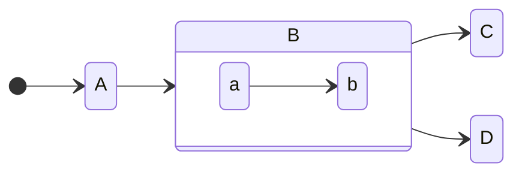
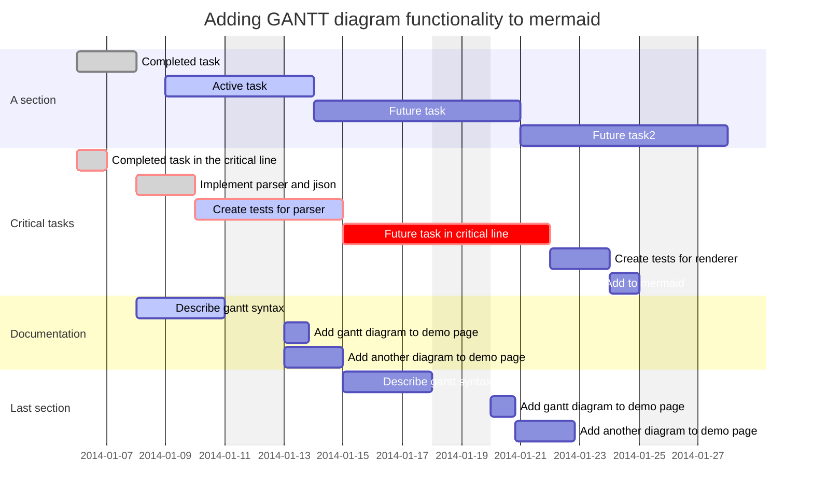

A showcase of syntax highlighting with this theme.

<!--more-->


## Synxtax test

```bash
# Prints all batteries, their percentage remaining and an emoji corresponding
# to charge status (🔌 for plugged up, 🔋 for discharging on battery, etc.).

case $BLOCK_BUTTON in
	3) notify-send " Battery module" ": discharging
🛑: not charging
♻: stagnant charge
🔌: charging
⚡: charged
❗: battery very low!
- Scroll to change adjust xbacklight." ;;
	4) xbacklight -inc 10 ;;
	5) xbacklight -dec 10 ;;
	6) "$TERMINAL" -e "$EDITOR" "$0" ;;
esac

# Loop through all attached batteries and format the info
for battery in /sys/class/power_supply/BAT?*; do
	# If non-first battery, print a space separator.
	[ -n "${capacity+x}" ] && printf " "
	# Sets up the status and capacity
	case "$(cat "$battery/status" 2>&1)" in
		"Full") status="⚡" ;;
		"Discharging") status=" " ;;
		"Charging") status="🔌 " ;;
		"Not charging") status="🛑" ;;
		"Unknown") status="♻️ " ;;
		*) exit 1 ;;
	esac
	capacity="$(cat "$battery/capacity" 2>&1)"
	# Will make a warn variable if discharging and low
	[ "$status" = "" ] && [ "$capacity" -le 30 ] && warn="❗"
	# Prints the info
	printf "%s%s%d%%" "$status" "$warn" "$capacity"; unset warn
done && printf "\\n"


```


## mermaid

 ```mermaid
%%{init: {'theme': 'forest', "flowchart" : { "curve" : "basis" } } }%%
graph TD;
    A-->B;
    A-->C;
    B-->D;
    C-->D;
```






```haskell

fib 0 = 0
fib 1 = 1
fib n = fib (n-1) + fib (n-2)

```

```python
def fib(n):
    a, b = 0, 1
    while a < n:
        print(a, end=' ')
        a, b = b, a+b
    print()
fib(1000)

```


```bash
sudo apt install neovim -y


```

Download `stow` and `git`.

Clone into your `$HOME` directory or `~`.

You'll also need a [nerd font](https://github.com/ryanoasis/nerd-fonts) to view icons with my set up. 

``````
git clone https://github.com/cmpi66/dotfiles.git ~
``````
Run `stow` to symlink everything or select any config files you want. 

``````bash
stow */ # this gets everything; the '/' ignores the README
``````
``````bash
stow fish # Only my fish config
``````


```lua
require("zk").setup({
  -- can be "telescope", "fzf" or "select" (`vim.ui.select`)
  -- it's recommended to use "telescope" or "fzf"
  picker = "select",

  lsp = {
    -- `config` is passed to `vim.lsp.start_client(config)`
    config = {
      cmd = { "zk", "lsp" },
      name = "zk",
      -- on_attach = ...
      -- etc, see `:h vim.lsp.start_client()`
    },

    -- automatically attach buffers in a zk notebook that match the given filetypes
    auto_attach = {
      enabled = true,
      filetypes = { "markdown" },
    },
  },
})

```

```rust

fn main() {
    println!("Hello, world!");
    let x = 15;
}
```


```bash
#!/bin/sh

# Requires ffmpeg

[ ! -f "$2" ] && printf "The first file should be the audio, the second should be the timecodes.\\n" && exit

echo "Enter the album/book title:"; read -r booktitle
echo "Enter the artist/author:"; read -r author
echo "Enter the publication year:"; read -r year

inputaudio="$1"
ext="${1#*.}"

# Get a safe file name from the book.
escbook="$(echo "$booktitle" | iconv -cf UTF-8 -t ASCII//TRANSLIT | tr -d '[:punct:]' | tr '[:upper:]' '[:lower:]' | tr ' ' '-' | sed "s/-\+/-/g;s/\(^-\|-\$\)//g")"

! mkdir -p "$escbook" &&
    echo "Do you have write access in this directory?" &&
    exit 1

# Get the total number of tracks from the number of lines.
total="$(wc -l < "$2")"

cmd="ffmpeg -i \"$inputaudio\" -nostdin -y"

while read -r x;
do
    end="$(echo "$x" | cut -d'	' -f1)"
    file="$escbook/$(printf "%.2d" "$track")-$esctitle.$ext"
    if [ -n "$start" ]; then
	cmd="$cmd -metadata artist=\"$author\" -metadata title=\"$title\" -metadata album=\"$booktitle\" -metadata year=\"$year\" -metadata track=\"$track\" -metadata total=\"$total\" -ss \"$start\" -to \"$end\" -vn -c:a copy \"$file\" "
    fi
    title="$(echo "$x" | cut -d'	' -f2-)"
    esctitle="$(echo "$title" | iconv -cf UTF-8 -t ASCII//TRANSLIT | tr -d '[:punct:]' | tr '[:upper:]' '[:lower:]' | tr ' ' '-' | sed "s/-\+/-/g;s/\(^-\|-\$\)//g")"
    track="$((track+1))"
    start="$end"
done < "$2"

# Last track must be added out of the loop.
file="$escbook/$(printf "%.2d" "$track")-$esctitle.$ext"
cmd="$cmd -metadata artist=\"$author\" -metadata title=\"$title\" -metadata album=\"$booktitle\" -metadata year=\"$year\" -metadata track=\"$track\" -ss \"$start\" -vn -c copy \"$file\""

eval "$cmd"


```
